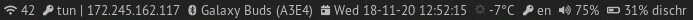

# dwm-bar

> Originl code: Joe Standring ([original repo](https://github.com/joestandring/dwm-bar))

A modular statusbar for DWM

## Table of Contents

- [dwm-bar](#dwm-bar)
  - [Table of Contents](#table-of-contents)
    - [dwm_alsa](#dwm_alsa)
    - [dwm_battery](#dwm_battery)
    - [dwm_keyboard](#dwm_keyboard)
    - [dwm_date](#dwm_date)
    - [dwm_weather](#dwm_weather)
    - [dwm_network](#dwm_network)
    - [dwm_openvpn](#dwm_openvpn)
    - [dvm_bluetooth](#dvm_bluetooth)
  - [Installation](#installation)
  - [Quick Start](#quick-start)
  - [Customizing](#customizing)
  - [Acknowledgements](#acknowledgements)

### dwm_alsa

Displays the current master volume of ALSA

     55%

Dependencies: `alsa-utils`

### dwm_battery

Displays battery level and status

     43% dischr

### dwm_keyboard

Displays the current keyboard layout

     en

### dwm_date

Displays the current date and time

     Mon 06-05-19 21:31:58]

### dwm_weather

Displays the current weather provided by [wttr.in](https://wttr.in)

     +4°C

Make it works:

    cd misc
    cp weather.service weather.timer ~/.config/systemd/user
    systemctl --user enable weather.service weather.timer
    systemctl --user start weather.service weather.timer

### dwm_network

Displays the current network connection, private IP, and public IP

     HomeWifi

Dependencies: `nmcli`

### dwm_openvpn

Displays the current OpenVPN connection

     tun | 172.246.163.117

### dvm_bluetooth

Displays current bluetooth connections

     Galaxy Buds (A3E4)

Dependencies: [`sluez`](https://github.com/vishen/sluez)

## Installation

1. Clone and enter the repository:

        git clone https://github.com/lisp3r/dwm-bar
        cd dwm-bar

2. Make the script executable

        chmod +x dwm_bar.sh

## Quick Start

Simply run the script and dwm should display your bar:

    ./dwm_bar.sh

Most likely, you will need to change some values for functions to get them to work - these are outlined with a comment for functions where this is likely the case.

If you would like your bar to be displayed when X starts, add this to your `.xinitrc` file before launching dwm. For example, if the script is located in `/home/$USER/dwm-bar/`:

    # Statusbar
    /home/$USER/dwm-bar/dwm_status.sh &

    # Start dwm
    exec dwm

## Customizing

dwm-bar is completley modular, meaning you can mix and match functions to your hearts content. It's functions are located in the bar-functions/ subdirectory and included in dwm_bar.sh
If you want to make your own function, for example dwm_myfunction.sh, you should create it in the bar-functions/ subdirectory before including it in dwm_bar.sh and adding it to the xsetroot command:

    # Import the modules
    . "$DIR/bar-functions/dwm_myfucntion"

    while true
    do
        xsetroot -name "$(dwm_myfunction)"
        sleep 1
    done

## Acknowledgements

Code for some functions was modified from:

- [Klemens Nanni](https://notabug.org/kl3)
- [@boylemic](https://github.com/boylemic/configs/blob/master/dwm_status)
- [Parket Johnson](https://github.com/ronno/scripts/blob/master/xsetcmus)
- [suckless.org](https://dwm.suckless.org/status_monitor/)
